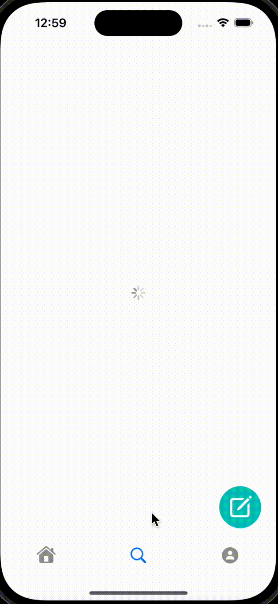

# 청년부 미니 SNS
## 스프링부트 , JPA를 활용한 객체지향적인 설계 추구
### 프로젝트 소개
위 프로젝트는 SNS 애플리케이션을 만들기 위한 프로젝트로 클라이언트 영역(안드로이드,ios)과 서버(자바,스프링) 영역을 분담하여 프로젝트를 진행하였습니다.
서버의 경우 Spring boot와 JPA를 중점적으로 개발하였으며 Spring Security,Validation 등을 활용하였습니다. 
모바일 어플리케이션의 특성상 주로 Api로 통신하였으며 Restful한 설계를 지향하였습니다.
현재 버전은 베타버전으로 앞으로 계속해서 기능을 발전시켜 나갈 예정입니다. 

* 제작 기간은 2달 정도 소요됐으며, 구성원은 다음과 같습니다.

<a href = "https://github.com/LDH0094"> 임 도현 (Api,Database 설계 & 구현, 관리자 페이지(웹)) </a>

<a href = "https://github.com/Doreki"> 이 덕현 (모바일 애플리케이션 담당)</a>

### 기능구현

게시판의 기본적인 CRUD기능을 구현하였습니다. 사용자 편의성에 맞춰 좋아요 기능을 구현하였습니다.
사용자에 따라 좋아요한 게시물 정보를 DB에 저장하고 좋아요한 게시물에 따라 하트 표시가 뜨도록 구현하였습니다.
또한 사용자가 자신이 좋아요를 누른 게시물을 볼 수 있도록 하였으며 게시글의 시간 순서가 아닌 좋아요를 누른 시간 순대로 게시물으 뜨도록 하였습니다. 

글쓰기와 좋아요(좌)

좋아요 게시물(우)

### TDD와 단위테스트

TDD를 중심으로 개발하며 더 나은 설계를 추구 하였습니다. 테스트 코드를 작성하므로써 더 많은 시간이 걸리는 것 같아보였습니다. 하지만 에러가 발생할 경우 미리 작성한 단위 테스트 코드로 인해 어디서 에러가 발생했는지 쉽게 알 수 있었습니다. 

