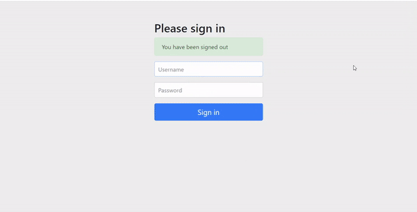
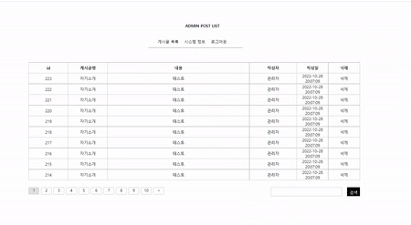

# 청년부 미니 SNS
## 스프링부트 , JPA를 활용한 객체지향적인 설계 추구
### 프로젝트 소개
* 위 프로젝트는 SNS 애플리케이션을 만들기 위한 프로젝트로 클라이언트 영역(안드로이드,ios)과 서버(자바,스프링) 영역을 분담하여 프로젝트를 진행하였습니다.
* Spring boot와 JPA를 중점적으로 개발하였으며 Spring Security,Validation 등을 활용하였습니다. 
* 모바일 어플리케이션의 특성상 주로 Api로 통신하였으며 Restful한 설계를 지향하였습니다.
* 현재 버전은 베타버전으로 앞으로 계속해서 기능을 발전시켜 나갈 예정입니다.
* 제작 기간은 2달 정도 소요됐으며, 구성원은 다음과 같습니다.

<a href = "https://github.com/Doreki"> 임 도현 (Api,Database 설계 & 구현, 관리자 페이지(웹)) </a>

<a href = "https://github.com/LDH0094"> 이 덕현 (모바일 애플리케이션 담당)</a>

### 목차

* 기능 소개
* TDD와 단위테스트
* 객체지향적 설계
* 도메인 주도 설계

### 기능 소개

게시판의 기본적인 CRUD기능을 구현하였습니다. 하지만 어플리케이션의 모든 기능을 설명하지 않고 가장 핵심적인 기능 위주로 설명하겠습니다.

#### 1. 좋아요 기능

 사용자 편의성에 맞춰 좋아요 기능을 구현하였습니다.
사용자에 따라 자신이 좋아요한 게시물에 하트 표시가 나타도록 구현하였습니다.
로그아웃을 하고 다시 로그인을 한 경우에도 좋아요 정보가 남도록 Likes 엔티티를 만들어 DB에 저장하도록 하였습니다.
또한 우측 마이페이지 버튼을 클릭하면 사용자가 자신이 좋아요를 누른 게시물을 볼 수 있도록 하였습니다.
메인페이지는 최신글들이 올라올 수 있도록 하였고 마이페이지는 최신글 순서가 아닌 사용자가 사용자가 좋아요를 누른 시간 순서대로 게시물이 로딩되도록 하였습니다. 

글쓰기    |  좋아요 게시물
:-------------------------:|:-------------------------:
  |   


사용자에 따라 좋아요 누른 게시물에 하트 표시가 나타나도록 하는 기능을 구현하면서 마주 했던 가장 큰 문제는 n+1 문제였습니다.
위 기능은 memberId 하나의 값으로 Likes를 추적하고 Likes로 Posts의 존재여부를 추적해야했습니다.
처음에는 exsist문을 활용하여 문제에 접근하였습니다.
기능은 구현이 됐지만 로그를 살펴보니 쿼리문이 너무 많이 나가는 것이었습니다.
제가 짠 로직을 자세히 살펴보니 PostsList의 스트림이 한번 돌때마다 쿼리문이 나가는 것이었습니다.
이유는 exsist문은 단일 객체를 대상으로 boolean 값을 반환하기 때문이었는데 List에 담긴 객체 수만큼 쿼리문이 추가로 나가는 것이었습니다.
그래서 쿼리문을 줄이기 위해 접근방식을 바꿨습니다.

``` java

@Query("select l from Likes l" +
        " join fetch l.posts" +
        " where l.member.id = :memberId" +
        " and l.posts.id in :postsIds")
public List<Likes> findLikesByMemberIdAndPostsIds(@Param("memberId") Long memberId, @Param("postsIds")List<Long> postsIds);
```

문제를 해결하기 위하여 우선은 in 절을 이용하여 Likes 엔티티를 List로 가져왔습니다. 여기서 쿼리가 최대 10개가 나가던 것을 1개로 줄일 수 있었습니다.
문제는 가져온 Likes객체를 어떻게 boolean으로 변환시키냐는 것이었습니다.

``` java
    public List<PostsResponseDto> viewPosts(Long memberId, Pageable pageable) {

        Page<Posts> findPostsPage = postsRepository.findAllByOrderByIdDesc(pageable);
        List<Long> findPostsIds = getPostsIds(findPostsPage.get());
        List<Likes> findLikes = likesRepository.findLikesByMemberIdAndPostsIds(memberId,findPostsIds);
        List<PostsResponseDto> postsList = toPostsDto(findPostsPage);

        updateWhetherIsLiked(findLikes, postsList);

        postsListSizeCheck(postsList);

        return postsList;
    }
    
     static void updateWhetherIsLiked(List<Likes> findLikes, List<? extends PostsResponseDto> findPostsList) {
        Map<Long, Likes> likesMap = toLikesMapByPostsId(findLikes);
        findPostsList.stream().filter(p -> likesMap.containsKey(p.getPostsId())).forEach(p -> p.updateIsLiked(true));
    }
    
    private static Map<Long, Likes> toLikesMapByPostsId(List<Likes> findLikes) {
        return findLikes.stream().collect(Collectors.toMap(l -> l.getPosts().getId(), l -> l));
    }
```
우선은 LikesList를  <postsId,Likes> 형태의 map으로 변환시켰습니다.
이렇게 하므로써 postsId를 키값으로 하여 Likes엔티티가 존재하는지를 쉽게 파악할 수 있게 되었습니다.
그리고 stream의 filter 메소드를 이용하여 Posts와 Likes가 매칭이 되는 경우에만 Dto의 boolean값을 true로 저장되도록 하였습니다.
결론적으로 DB커넥션이 여러번 타던 로직을 메모리에서 반복문을 여러번 돌리는 형식으로 로직을 수정한 것입니다.
아무래도  DB커넥션을 여러번 타는 것 보다는 메모리에서 여러번 반복이 도는 것이 더 효율적이라고 생각했기 때문에 이렇게 로직을 수정하였습니다.

#### 2. 관리자 페이지

위 프로젝트는 모바일 어플리케이션 프로젝트이지만 게시글을 효율적으로 관리하기 위해 웹 페이지로 관리자 페이지를 구현하였습니다.


게시글 페이징처리

스프링 시큐리티를 활용하여 관리자만 관리자페이지에 접근할 수 있도록 구현하였습니다.
api통신을 활용하여 자바스크립트로 페이징 처리를 하였으며 http get method의 쿼리스트링을 파라미터로 받아서 페이지를 리로딩하지 않고 api 통신으로 필요한 데이터만 리로딩하여서 한정된 자원 내에서 최대한 자원을 효율적으로 사용하고자 하였습니다.



게시글 삭제기능

``` java 
    @DeleteMapping("/posts/{postsId}")
    public ResponseEntity<?> deletePosts(@PathVariable Long postsId, @AuthenticationPrincipal PrincipalDetails principalDetails) {
        if(isAdmin(principalDetails))
            postsService.deletePosts(postsId);
        else
            throw new MemberMismatchException("권한이 없습니다.");

        return ResponseEntity
                .ok(CMResponseDto.createCMResponseDto(1,"게시글이 삭제되었습니다.",null));
    }
    private static boolean isAdmin(PrincipalDetails principalDetails) {
        return principalDetails.getRole() == Role.ADMIN;
    }
```
스프링 시큐리티로 1차적으로 권한을 막았지만 api 해킹의 위험성을 예방하기 위해 세션 저장소에 저장되어있는 유저 정보의 Role이 Admin일때만 Delete문이 나가도록 구현하였습니다.


### TDD와 단위테스트

TDD를 중심으로 개발하며 더 나은 설계를 추구 하였습니다. 테스트 코드를 작성하므로써 더 많은 시간이 걸리는 것 같아보였습니다. 하지만 에러가 발생할 경우 미리 작성한 단위 테스트 코드로 인해 어디서 에러가 발생했는지 쉽게 알 수 있었습니다.
이는 책임의 분리가 잘 이루어졌기 때문에 가능했던 일이라 생각합니다. 테스트코드를 먼저 작성함으로써 실제 코드를 구현하기 전에 SRP에 입각한 설계가 머리 속에 그려졌고 또한 내 코드가 더 익숙하게 다가왔습니다.

``` java
    @Test
    @WithMockCustomMember(role = Role.ADMIN)
     public void 글삭제() throws Exception{
        //given

        Long postsId = 1L;
        //when
        mockMvc.perform(
                        delete("/api/v1/admin/{postsId}", postsId)
                                .contentType(MediaType.APPLICATION_JSON))
                                .andExpect(status().isOk());
        //then
        verify(postsService).deletePosts(postsId);
    }

    @Test
    @WithMockCustomMember(role = Role.MEMBER)
    public void 글삭제_실패() throws Exception{
        //given

        Long postsId = 1L;
        //when
        mockMvc.perform(
                        delete("/api/v1/admin/{postsId}", postsId)
                                .contentType(MediaType.APPLICATION_JSON))
                .andExpect(status().isForbidden());
    }
```

가짜객체를 직접 정의하여서 스프링 시큐리티를 테스트하는 코드 

``` java
    public List<LikedPostsResponseDto> viewLikedPosts(Long memberId, Pageable pageable) {
        Page<Likes> findLikesPage = likesRepository.findLikesByMemberIdOrderByDesc(memberId,pageable);

        List<Posts> findPostsList = toPosts(findLikesPage);
        List<Likes> findLikesList = findLikesPage.stream().collect(Collectors.toList());
        List<LikedPostsResponseDto> likedPostsDtos = toPostsDto(findPostsList);

        updateWhetherIsLiked(findLikesList, likedPostsDtos);
        updateLikedDate(likedPostsDtos,findLikesList);

        postsListSizeCheck(likedPostsDtos);
        return likedPostsDtos;
    }
```
위의 코드는 서비스 계층의 좋아요 누른 게시물 목록을 가져오는 메소드입니다.
 하나의 메소드 이지만 SRP의 기준에서 본다면 더 작은 단위의 메소드로 나눌 수 있습니다.

* 좋아요한 게시물 목록을 가져와서 Dto로 변환하는 기능
* 좋아요 여부(하트)를 업데이트 하는 기능
* 좋아요 누른 시간을 업데이트 하는 기능

``` java
    @Test
     public void 좋아요_게시물_찾아오기() throws Exception{
        //given
        Member member = createMember("글쓴이", "1", 1L);

        List<Posts> postsList = new ArrayList();
        List<Likes> likesList = new ArrayList();
        for (int i = 0; i < 10; i++) {
            Posts posts = createPosts(member, "글제목", "글내용", 1L+i);
            postsList.add(posts);
            Likes likes = Likes.createLikes(posts, member);
            likesList.add(likes);
        }
        PageRequest pageRequest = PageRequest.of(0, 10);
        Page<Likes> page = new PageImpl<>(likesList);

        given(likesRepository.findLikesByMemberIdOrderByDesc(member.getId(),pageRequest)).willReturn(page);
        //when
        List<LikedPostsResponseDto> postsResponseDtos = postsService.viewLikedPosts(member.getId(), pageRequest);
        //then
        verify(likesRepository).findLikesByMemberIdOrderByDesc(member.getId(),pageRequest);
        assertThat(postsResponseDtos.size()).isEqualTo(10);
    }
    
    @Test
     public void 좋아요_여부_업데이트() throws Exception{
        //given
        Member member = createMember("홍길동", "1", 1L);
        List<Posts> postsList = new ArrayList<>();
        List<Likes> likesList = new ArrayList<>();
        for (int i = 1; i <= 10; i++) {
            Posts posts = createPosts(member, "글제목", "글내용", i + 0L);
            postsList.add(posts);
            likesList.add(Likes.createLikes(posts,member));
        }
        List<Long> postsIds = postsList.stream().map(Posts::getId).collect(Collectors.toList());
        List<PostsResponseDto> postsResponseDtos = toPostsDto(postsList);
        given(likesRepository.findLikesByMemberIdAndPostsIds(member.getId(), postsIds)).willReturn(likesList);
        //when
        postsService.updateWhetherIsLiked(likesList,postsResponseDtos);
        //then
        assertThat(postsResponseDtos.get(0).isLiked()).isEqualTo(true);
    }

    private static List<PostsResponseDto> toPostsDto(List<Posts> postsList) {
        return postsList.stream().map(PostsResponseDto::createPostsResponseDto).collect(Collectors.toList());
    }

    @Test
     public void 좋아요_시간_업데이트() throws Exception{
        //given
        Member member = createMember("홍길동", "1", 1L);
        List<Posts> postsList = new ArrayList<>();

        Posts posts = createPosts(member, "글제목", "글내용", 1L);
        postsList.add(posts);

        List<Likes> likesList = new ArrayList<>();
        Likes likes = Likes.createLikes(posts, member);
        likesList.add(likes);
        List<LikedPostsResponseDto> likedPostsResponseDtos = toLikedPostsDtos(postsList);
        //when
        postsService.updateLikedDate(likedPostsResponseDtos,likesList);
        //then
        assertThat(likedPostsResponseDtos.get(0).getLikedDate()).isEqualTo(likes.getLikedDate());
    }
```

단일 책임의 원칙의 관점에서 여러가지 메소드로 분류할 수 있기 때문에 각 단위별로 나눠서 단위테스트를 진행하였습니다.
단위테스트를 진행함으로 인해 좀 더 명확하게 에러가 발생한 부분을 찾을 수 있습니다.
단위테스트를 진행하지 않고 통합테스트를 할 경우 의존성 관계가 많이 엮이면 엮일 수록 에러가 어디서 발생했는지 찾기 힘들고 테스팅 하는 시간이 점점 무거워지는 단점이 있습니다.

### 객체지향적인 설계
상속과 관심사의 분리를 통해 객체지향적인 설계를 지향하였습니다.
공통의 관심사를 상속관계로 풀어내서 유지보수에 용이한 코드를 구현하고자 하였습니다.
``` java
    @Transactional
    public Long join(JoinRequestDto joinRequestDto) {

        //userTag를 생성하기 위해 우선적으로 DB에 저장
        Member member = joinRequestDto.toEntity();
        try{
            member = memberRepository.save(member);
        } catch (DataIntegrityViolationException e) {
            throw new OverlapMemberException("중복된 회원입니다.");
        }
        member.createUserTag();
        //DB에서 받아온 id로 닉네임에 유저태그 더해줌
        return member.getId();
    }
```

서비스계층의 join 메서드의 경우 JoinRequestDto라는 추상클래스를 매개변수로 받고 있습니다.
JoinRequestDto는 BasicJoinRequestDto,KakaoJoinRequestDto의 조상이 되는 클래스입니다.
이렇게 구현한 이유는 회원가입의 경우 일반 회원가입과 카카오 회원가입이 공통된 영역이 존재하지만 엔티티가 Dto로 변환돼서 데이터베이스에 저장될때 다른 방식으로 처리 되기 때문입니다.

``` java
@SuperBuilder
@Data
@NoArgsConstructor
public class BasicJoinRequestDto extends JoinRequestDto {

    @Pattern(regexp = "^[0-9a-zA-Z~!@#$%^&*_]*$",message = "한글은 입력할 수 없습니다.",groups = ValidationGroups.PatternCheckGroup.class)
    @NotBlank(message = "아이디는 비워 둘 수 없습니다.", groups = ValidationGroups.NotBlankGroup.class)
    private String username;
    @NotBlank(message = "비밀번호는 비워 둘 수 없습니다", groups = ValidationGroups.NotBlankGroup.class)
    @Size(min = 8, max = 16, message = "비밀번호는 8자 부터 16자까지 입력하여야 합니다", groups = ValidationGroups.SizeGroup.class)
    @Pattern(regexp = "^(?=.*[a-zA-Z])(?=.*\\d)(?=.*[~!@#$%^&*_])[a-zA-Z\\d-~!@#$%^&*_]*$",
             message = "비밀번호는 특수기호, 영문, 숫자를 모두 포함해야합니다.",
             groups = ValidationGroups.PatternCheckGroup.class)
    private String password;


    public BasicMember toEntity() {
        return BasicMember.builder()
                .username(username)
                .password(new BCryptPasswordEncoder().encode(password))
                .nickname(nickname)
                .provider(Provider.BASIC)
                .role(Role.MEMBER)
                .build();
    }
}

@SuperBuilder
@Data
@NoArgsConstructor
public class KakaoJoinRequestDto extends JoinRequestDto {

    private String authId;


    public KakaoMember toEntity() {
        return KakaoMember.builder()
                .authId(authId)
                .nickname(nickname)
                .provider(Provider.KAKAO)
                .role(Role.MEMBER)
                .build();
    }
}
```

BasicJoinRequestDto의 경우 일반적인 회원가입이기 때문에 DB에 id와 password가 저장되어야 합니다. 반면에 KakaoJoinRequestDto의 경우는 authId만 저장되면 됩니다.
그렇기에 공통적인 부분은 추상클래스로 빼놓고 toEntity 메서드를 오버라이딩을 통해 각자 따로 구현하였습니다. 

### 도메인 주도 설계

도메인 주도 설계를 적용시켜 단위 테스트를 적용하기 쉽도록 설계하였습니다. 뿐만 아니라 도메인 객체가 스스로 할 수 있는 기능들은 최대한 스스로 할 수 있게 하므로써
외부 객체와의 의존관계를 줄이고자 노력하였습니다. 이러한 설계를 통해 유지 보수에 유리한 설계를 만들고자 하였습니다.

``` java
@AllArgsConstructor
@NoArgsConstructor(access = AccessLevel.PROTECTED)
@Getter
@Inheritance(strategy = InheritanceType.SINGLE_TABLE)
@DiscriminatorColumn(name = "dtype")
@Entity
public abstract class Member extends BaseTimeEntity {

    @Id //pk
    @GeneratedValue(strategy = GenerationType.IDENTITY)
    @Column(name = "member_id")
    private Long id;
    @Column(nullable = false)
    private String nickname;
    @Column(unique = true)
    private String userTag;

    @Enumerated(EnumType.STRING)
    private Provider provider;

    @Enumerated(EnumType.STRING)
    private Role role;

    public void updateNickname(String nickname) {
        this.nickname = nickname;
    }

    public String createUserTag() {
        String userTag = "";
        if (id / 10 == 0) {
            userTag = "000" + id;
        } else if (id / 100 == 0) {
            userTag = "00" + id;
        } else if (id / 1000 == 0) {
            userTag = "0" + id;
        } else {
            userTag = "" + id;
        }
        userTag = "#" + userTag;
        this.userTag = userTag;

        return userTag;
    }

}
```

저희 프로젝트에서는 멤버 정보를 저장할때 별도의 userTag를 만들어서 닉네임과 함께 저장합니다. 
이때 다른 객체들과의 의존성을 없애고 member 객체 스스로 userTag의 기능을 수행하도록 하였습니다.
다른 객체에 의존하는 것이 아무 것도 없기 때문에 단위 테스트를 가볍게 수행할 수 있다는 장점이 있습니다.

``` java
    @Test
     public void 유저태그_생성() throws Exception{
        //given
        Member member1 = createMember(1L, "홍길동", "1");
        Member member2 = createMember(10L, "홍길동", "1");
        Member member3 = createMember(100L, "홍길동", "1");
        Member member4 = createMember(1000L, "홍길동", "1");
        Member member5 = createMember(10000L, "홍길동", "1");

        String userTag1 = member1.createUserTag();
        String userTag2 = member2.createUserTag();
        String userTag3 = member3.createUserTag();
        String userTag4 = member4.createUserTag();
        String userTag5 = member5.createUserTag();
        //when
        assertThat(userTag1).isEqualTo("#0001");
        assertThat(userTag2).isEqualTo("#0010");
        assertThat(userTag3).isEqualTo("#0100");
        assertThat(userTag4).isEqualTo("#1000");
        assertThat(userTag5).isEqualTo("#10000");
        //then
    }
```

이렇게 userTag 정보에 대한 기능만 단위테스트를 진행하기 때문에 Mock 객체 조차도 만들지 않아도 되고 다른 의존성 객체들을 띄우지 않고 아주 빠르게 테스트를 진행할 수 있습니다.
또한 코드가 변경 되었을 때도 해당 기능에 대한 테스트만 진행하면 된다는 장점이 있습니다.

### 마무리
해당 프로젝트를 진행하며 TDD와 단위테스트를 중점으로 두며 유연한 설계와 클린한 코드를 유지하려고 노력하였습니다.
단순한 기능 구현에만 중점을 두지 않고 최적화와 유연한 설계를 위해 계속해서 스스로 고민하며 테스트 코드를 작성하고 꾸준하게 리팩토링을 진행하였습니다.
이로 인해 많은 기능을 구현하지는 못했지만 개발 실력이 비약적으로 증가하며 코드가 개선되는 것을 느꼈습니다.
